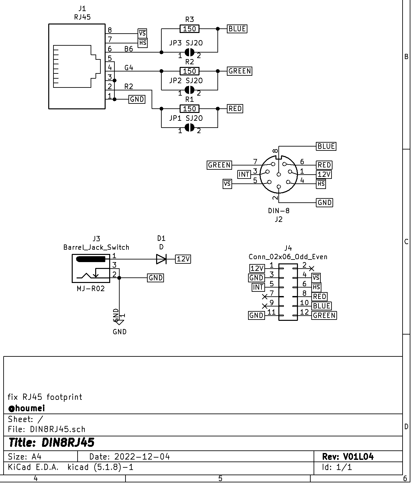
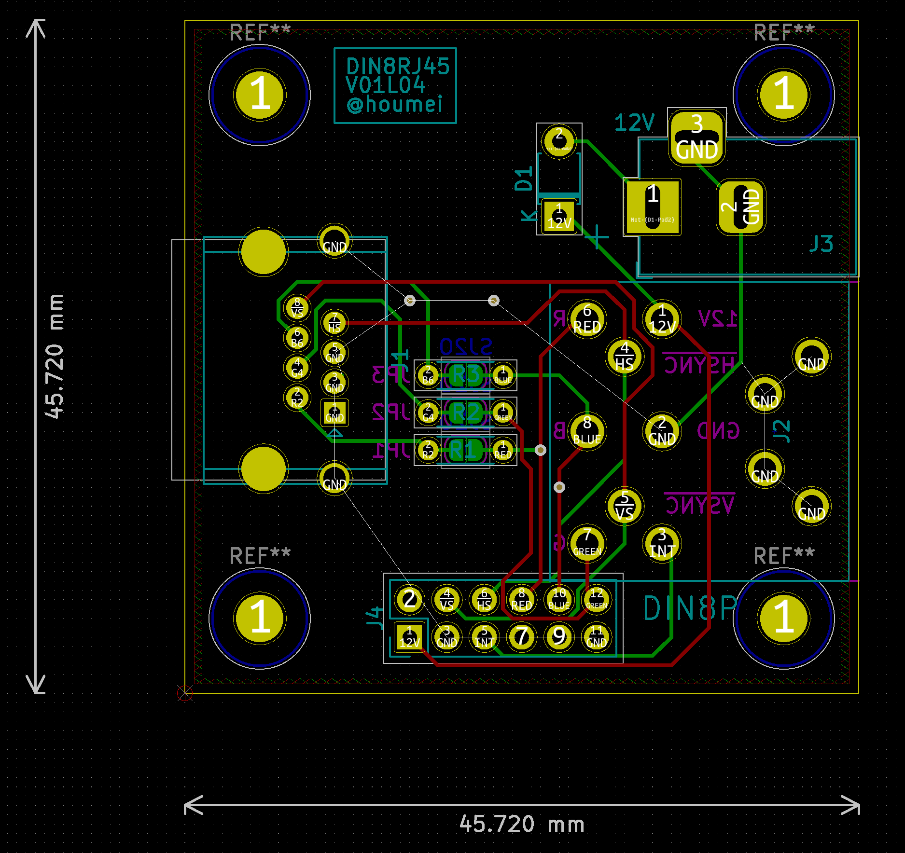

# DIN8RJ45 - DigitalRGB DIN8P connector to VGA-RJ45 converter (KiCad5)

Schematic

PCB

## 説明

[SORDm5C V01L02 SORD m5用ROM/RAMカートリッジ](http://blog.livedoor.jp/hardyboy/archives/10058478.html "まごころせいじつ堂")  
[SORD m5用ROM/RAMカートリッジ基板](https://keisanki.booth.pm/items/3939000 "booth")  

## 履歴
V01L01(非公開) 初版 RJ45のフットプリントミス  
V01L02(非公開) RJ45のフットプリントミス  
V01L03(非公開) RJ45のフットプリントミス ヤンナルネ  
V01L04(非公開) 正常動作確認  

## DIN8RJ45V01L04GB - Gerber
JLCPCBなどにそのまま出図可能です。  
